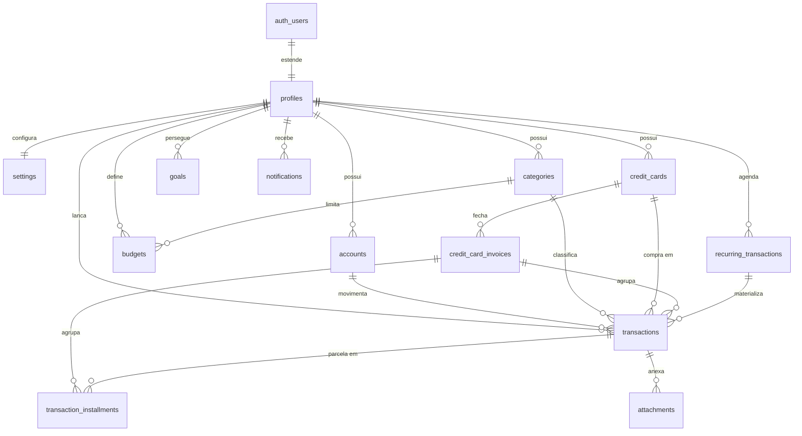

# Sistema Financeiro Pessoal — Documento de Arquitetura (v1)

**Stack:** Next.js 15 · React 19 · TypeScript (strict) · TailwindCSS · shadcn/ui · Supabase (PostgreSQL + Auth + Storage) · React Hook Form · Zod · TanStack Query · Recharts · Lucide Icons · Deploy na Vercel

**Status:** fase de arquitetura — nenhum código escrito ainda. Implementação começa após aprovação deste documento.

---

## Sumário

1. [Visão geral e decisões de arquitetura](#1-visão-geral-e-decisões-de-arquitetura)
2. [Arquitetura de alto nível](#2-arquitetura-de-alto-nível)
3. [Estrutura de pastas](#3-estrutura-de-pastas)
4. [Modelagem do banco de dados](#4-modelagem-do-banco-de-dados)
5. [DER — Diagrama Entidade-Relacionamento](#5-der)
6. [Fluxo de autenticação](#6-fluxo-de-autenticação)
7. [Páginas](#7-páginas)
8. [Componentes](#8-componentes)
9. [Segurança](#9-segurança)
10. [Performance](#10-performance)
11. [Roadmap](#11-roadmap)
12. [Premissas e pontos em aberto](#12-premissas-e-pontos-em-aberto)

---

## 1. Visão geral e decisões de arquitetura

Produto: um sistema financeiro pessoal completo (contas, transações, parcelamentos, cartões com faturas, recorrências, orçamentos, metas, relatórios), single-user no início mas **multi-tenant desde o dia 1** — toda tabela tem `user_id` e Row Level Security, então abrir para mais usuários no futuro não exige refatoração.

As decisões estruturais que sustentam todo o resto:

**D1 — Dinheiro em `BIGINT` de centavos.** Nunca `float`/`double` (erro de arredondamento) e nem `numeric` no app layer (fricção de serialização). `R$ 300,00 = 30000`. Conversão para exibição centralizada em `lib/money.ts`. Divisão de parcelas trata resto: `12x de R$ 100,01` → 11 parcelas de `10001` + 1 de ajuste para fechar o total exato.

**D2 — Transações são a fonte da verdade; saldo é derivado.** Nenhuma tabela armazena "saldo atual". Saldo da conta = `initial_balance_cents` + soma das transações **pagas** daquela conta. Isso elimina qualquer possibilidade de drift entre saldo armazenado e histórico. Agregações ficam em views/funções SQL (rápidas com os índices certos).

**D3 — Transferência = par espelhado.** Uma transferência gera **duas** linhas em `transactions` (saída na origem, entrada no destino) ligadas por `transfer_group_id`. Vantagem: o saldo de qualquer conta é uma soma simples sobre uma coluna, sem lógica condicional. Relatórios de receita/despesa simplesmente excluem `type = 'transfer'`. Editar/excluir sempre opera no par (a Server Action trata o grupo atomicamente).

**D4 — Parcelamento = compra-mãe + parcelas-filhas.** A compra parcelada é 1 linha em `transactions` (valor total, ex.: R$ 3.600) + N linhas em `transaction_installments` (cada uma com número, valor, vencimento e status próprios). Para que relatórios e orçamentos contem o valor certo no mês certo, existe a view `v_entries`, que unifica: transações simples + parcelas individuais (a compra-mãe fica fora da view para não duplicar).

**D5 — Cartão de crédito: competência vs. caixa.** Decisão clássica de app financeiro, resolvida assim:

- **Relatórios/orçamentos por categoria** usam a **data da compra** (competência) — "gastei R$ 400 em alimentação em julho" independe de quando a fatura foi paga.
- **Saldo das contas** usa **caixa**: compra no cartão não debita conta nenhuma; quem debita é o **pagamento da fatura** (uma transação normal na conta escolhida).
  Compra no cartão tem `credit_card_id` + `invoice_id` e `account_id NULL`. O dashboard mostra os dois mundos de forma coerente.

**D6 — Recorrências materializadas por job.** `recurring_transactions` é o template; um job diário (`pg_cron`, extensão nativa do Supabase) chama `generate_recurring_transactions()`, que insere as transações devidas como `pending` e avança `next_run_date`. Idempotente por índice único parcial em `transactions (recurring_id, date)`. Fallback: a mesma função pode ser chamada on-demand no load do dashboard.

**D7 — RLS em 100% das tabelas + Storage.** Política padrão "own rows" (`user_id = auth.uid()`) para SELECT/INSERT/UPDATE/DELETE em todas as tabelas, e política de path no bucket de anexos. Mesmo que uma Server Action tenha bug, o banco não entrega dados de outro usuário. RLS é a última linha de defesa, não a única.

**D8 — Server Components por padrão; TanStack Query onde há interatividade.** Leitura inicial via RSC (rápido, sem waterfall no client). TanStack Query entra nas superfícies interativas: lista de transações (infinite scroll com cursor), filtros, mutações com optimistic update. Mutações sempre via **Server Actions** validadas com Zod.

---

## 2. Arquitetura de alto nível

```
┌──────────────────────────── Browser ────────────────────────────┐
│  React 19 + shadcn/ui + Tailwind                                 │
│  React Hook Form + Zod (validação client)                        │
│  TanStack Query (cache, infinite scroll, optimistic updates)     │
│  Recharts (dynamic import, client-only)                          │
└───────────────┬──────────────────────────────────────────────────┘
                │ HTTPS (cookies httpOnly gerenciados por @supabase/ssr)
┌───────────────▼───────────── Vercel ─────────────────────────────┐
│  Next.js 15 (App Router)                                         │
│  • middleware.ts → refresh de sessão + proteção de rotas         │
│  • Server Components → leitura de dados (createServerClient)     │
│  • Server Actions → mutações (Zod → regra de negócio → Supabase) │
│  • Route Handlers → /auth/callback, exports (CSV/XLSX/PDF)       │
└───────────────┬───────────────────────────────────────────────────┘
                │ supabase-js (anon key + JWT do usuário → RLS)
┌───────────────▼──────────── Supabase ────────────────────────────┐
│  Auth (e-mail/senha, confirmação, reset)                          │
│  PostgreSQL: tabelas + RLS + views + funções + triggers          │
│  pg_cron: materialização de recorrências (diário)                │
│  Storage: bucket `attachments` com RLS por path                  │
└───────────────────────────────────────────────────────────────────┘
```

Regras de fluxo:

1. **Leitura** — Server Component chama o Supabase com o client de servidor (cookie do usuário → RLS aplica o filtro). Para listas interativas, o RSC entrega o estado inicial e o TanStack Query assume as próximas páginas.
2. **Escrita** — o formulário (RHF + zodResolver) valida no client para UX; a **Server Action revalida com o mesmo schema Zod** (nunca confiar no client), executa a regra de negócio e retorna um `ActionResult<T>` padronizado (`{ ok: true, data } | { ok: false, error }`). Depois: `revalidatePath` + invalidação de query keys.
3. **Nenhuma chave sensível no client.** O browser só conhece a `anon key` (pública por design — RLS é quem protege). `SERVICE_ROLE_KEY` existe apenas em variáveis de ambiente do servidor e só é usada onde estritamente necessário (ex.: exclusão de conta).

---

## 3. Estrutura de pastas

Feature-Based Architecture: cada domínio é autocontido (componentes, actions, queries, schemas e tipos juntos). `components/` global guarda apenas o que é genérico de verdade.

```
finapp/
├── supabase/
│   ├── config.toml
│   └── migrations/
│       ├── 0001_extensions.sql        # pgcrypto, pg_cron
│       ├── 0002_enums.sql
│       ├── 0003_tables.sql
│       ├── 0004_constraints_indexes.sql
│       ├── 0005_rls.sql
│       ├── 0006_functions_triggers.sql # handle_new_user, set_updated_at, recorrências…
│       ├── 0007_views.sql              # v_entries, v_account_balances…
│       └── 0008_seed_defaults.sql      # categorias padrão (via trigger de signup)
├── src/
│   ├── app/
│   │   ├── (auth)/                     # rotas públicas, layout centrado
│   │   │   ├── login/page.tsx
│   │   │   ├── cadastro/page.tsx
│   │   │   ├── esqueci-senha/page.tsx
│   │   │   └── redefinir-senha/page.tsx
│   │   ├── auth/
│   │   │   ├── callback/route.ts       # exchangeCodeForSession
│   │   │   └── confirm/route.ts        # confirmação de e-mail (token_hash)
│   │   ├── (app)/                      # rotas protegidas, layout com sidebar
│   │   │   ├── layout.tsx
│   │   │   ├── dashboard/page.tsx
│   │   │   ├── transacoes/page.tsx
│   │   │   ├── contas/page.tsx
│   │   │   ├── categorias/page.tsx
│   │   │   ├── cartoes/
│   │   │   │   ├── page.tsx
│   │   │   │   └── [id]/page.tsx       # detalhe do cartão + faturas
│   │   │   ├── recorrentes/page.tsx
│   │   │   ├── orcamentos/page.tsx
│   │   │   ├── metas/page.tsx
│   │   │   ├── relatorios/page.tsx
│   │   │   └── configuracoes/page.tsx  # tabs: perfil · preferências · segurança · dados
│   │   ├── layout.tsx                  # root: fonts, ThemeProvider, Toaster, QueryProvider
│   │   ├── globals.css
│   │   ├── error.tsx / not-found.tsx
│   ├── components/
│   │   ├── ui/                         # shadcn (gerado pela CLI)
│   │   ├── layout/                     # AppSidebar, Topbar, MobileNav, CommandPalette…
│   │   ├── shared/                     # MoneyInput, DataTable, EmptyState, ConfirmDialog…
│   │   └── charts/                     # wrappers Recharts com tema
│   ├── features/
│   │   ├── transactions/
│   │   │   ├── components/
│   │   │   ├── actions.ts              # Server Actions
│   │   │   ├── queries.ts              # fetchers + hooks TanStack Query
│   │   │   ├── schemas.ts              # Zod (fonte única client + server)
│   │   │   └── types.ts
│   │   ├── accounts/  … mesmo padrão
│   │   ├── categories/
│   │   ├── cards/
│   │   ├── installments/
│   │   ├── recurring/
│   │   ├── budgets/
│   │   ├── goals/
│   │   ├── reports/
│   │   ├── notifications/
│   │   ├── dashboard/
│   │   └── settings/
│   ├── hooks/                          # use-debounce, use-media-query, use-confirm…
│   ├── lib/
│   │   ├── supabase/
│   │   │   ├── client.ts               # createBrowserClient
│   │   │   ├── server.ts               # createServerClient (cookies)
│   │   │   └── middleware.ts           # updateSession
│   │   ├── money.ts                    # centavos ⇄ BRL, divisão de parcelas
│   │   ├── dates.ts                    # competência, fuso America/Sao_Paulo
│   │   ├── action-result.ts            # tipo ActionResult<T> + helpers
│   │   ├── rate-limit.ts
│   │   └── utils.ts                    # cn() etc.
│   ├── services/                       # lógica de domínio pura (testável, sem React)
│   │   ├── invoices.ts                 # algoritmo de competência de fatura
│   │   ├── installments.ts             # geração/divisão de parcelas
│   │   ├── recurrence.ts               # cálculo de próximas ocorrências
│   │   └── export/
│   │       ├── csv.ts · xlsx.ts · pdf.ts
│   ├── types/
│   │   ├── database.ts                 # gerado: supabase gen types typescript
│   │   └── domain.ts                   # tipos de domínio derivados/compostos
│   └── middleware.ts
├── .env.example
├── next.config.ts · tsconfig.json (strict) · eslint.config.mjs · .prettierrc
└── package.json
```

**Convenções de código** (aplicadas desde a Fase 0): TypeScript `strict: true`, `noUncheckedIndexedAccess: true`; `any` proibido via regra ESLint (`@typescript-eslint/no-explicit-any: error`); schemas Zod são a fonte única de tipos de formulário (`z.infer`); `services/` não importa nada de React (funções puras → fáceis de testar); componentes nomeados em PascalCase, arquivos em kebab-case; comentários apenas onde a intenção não é óbvia (ex.: algoritmo de fatura).

---

## 4. Modelagem do banco de dados

### 4.1 Convenções gerais

| Convenção            | Regra                                                                                                                                                                   |
| -------------------- | ----------------------------------------------------------------------------------------------------------------------------------------------------------------------- |
| PKs                  | `uuid` com `gen_random_uuid()`                                                                                                                                          |
| Dinheiro             | `*_cents bigint` — sempre positivo; o sinal vem do `type`                                                                                                               |
| Datas de competência | `date` (sem hora, fuso do usuário)                                                                                                                                      |
| Auditoria            | `created_at` / `updated_at timestamptz` — trigger `set_updated_at()`                                                                                                    |
| FKs financeiras      | `ON DELETE RESTRICT` — histórico nunca some por cascata acidental; contas/categorias/cartões usam **arquivamento** (`is_archived`) em vez de delete quando há histórico |
| Enums                | tipos Postgres nativos (validados também no Zod)                                                                                                                        |
| RLS                  | habilitada em **todas** as tabelas                                                                                                                                      |

**Enums:**

```sql
create type account_type        as enum ('bank','wallet','cash','investment','digital');
create type category_type       as enum ('income','expense');
create type transaction_type    as enum ('income','expense','transfer');
create type transaction_status  as enum ('paid','pending','cancelled');
create type invoice_status      as enum ('open','closed','paid');
create type recurrence_freq     as enum ('daily','weekly','monthly','yearly');
create type goal_status         as enum ('active','completed','archived');
create type notification_type   as enum ('budget_alert','invoice_due','goal_reached','system');
```

### 4.2 Tabelas

#### `profiles` (a tabela "users" do domínio)

O Supabase gerencia `auth.users` (credenciais, e-mail, sessões) — não se mexe nela. `public.profiles` é a extensão 1:1 com os dados de perfil. Criada automaticamente no signup pelo trigger `handle_new_user()` (que também cria `settings` e as categorias padrão).

| Coluna                  | Tipo        | Regras                                      |
| ----------------------- | ----------- | ------------------------------------------- |
| id                      | uuid        | PK, FK → `auth.users(id)` ON DELETE CASCADE |
| full_name               | text        | not null                                    |
| avatar_url              | text        | nullable                                    |
| created_at / updated_at | timestamptz |                                             |

#### `settings`

Preferências do usuário, 1:1 com `profiles`.

| Coluna               | Tipo        | Regras                                                |
| -------------------- | ----------- | ----------------------------------------------------- |
| user_id              | uuid        | PK + FK → profiles ON DELETE CASCADE                  |
| theme                | text        | `'dark'` default · check in (`light`,`dark`,`system`) |
| currency             | char(3)     | default `'BRL'`                                       |
| locale               | text        | default `'pt-BR'`                                     |
| notify_budget_alerts | boolean     | default true                                          |
| notify_invoice_due   | boolean     | default true                                          |
| updated_at           | timestamptz |                                                       |

#### `accounts`

Contas do usuário (banco, carteira, dinheiro, investimento, conta digital). **Saldo não é armazenado** (decisão D2) — vem da view `v_account_balances`.

| Coluna                  | Tipo         | Regras                              |
| ----------------------- | ------------ | ----------------------------------- |
| id                      | uuid         | PK                                  |
| user_id                 | uuid         | FK → profiles, not null             |
| name                    | text         | not null · `unique (user_id, name)` |
| type                    | account_type | not null                            |
| initial_balance_cents   | bigint       | default 0                           |
| color                   | text         | hex, ex. `#8b5cf6`                  |
| icon                    | text         | nome do ícone Lucide                |
| is_archived             | boolean      | default false                       |
| created_at / updated_at | timestamptz  |                                     |

Índices: `(user_id)`.

#### `categories`

Categorias personalizadas de receita ou despesa. Categorias padrão são criadas no signup (Alimentação, Transporte, Moradia, Salário…), todas editáveis. Delete real só se não houver transações; caso contrário, arquiva.

| Coluna       | Tipo          | Regras                                    |
| ------------ | ------------- | ----------------------------------------- |
| id           | uuid          | PK                                        |
| user_id      | uuid          | FK → profiles, not null                   |
| name         | text          | not null · `unique (user_id, name, type)` |
| type         | category_type | not null                                  |
| color / icon | text          |                                           |
| is_archived  | boolean       | default false                             |
| created_at   | timestamptz   |                                           |

Índices: `(user_id, type)`.

#### `transactions` — o coração do sistema

Cada movimento financeiro é uma linha: receita, despesa (à vista, no cartão ou parcelada-mãe) ou perna de transferência.

| Coluna                  | Tipo               | Regras                                                    |
| ----------------------- | ------------------ | --------------------------------------------------------- |
| id                      | uuid               | PK                                                        |
| user_id                 | uuid               | FK → profiles, not null                                   |
| account_id              | uuid               | FK → accounts RESTRICT · **null quando compra no cartão** |
| credit_card_id          | uuid               | FK → credit_cards RESTRICT · null quando não é cartão     |
| invoice_id              | uuid               | FK → credit_card_invoices · fatura da compra              |
| category_id             | uuid               | FK → categories RESTRICT · **null em transferências**     |
| type                    | transaction_type   | not null                                                  |
| status                  | transaction_status | default `'pending'`                                       |
| description             | text               | not null                                                  |
| notes                   | text               | nullable                                                  |
| amount_cents            | bigint             | not null · check `> 0`                                    |
| date                    | date               | not null (competência)                                    |
| paid_at                 | timestamptz        | preenchido quando status = paid                           |
| transfer_group_id       | uuid               | liga o par da transferência (D3)                          |
| recurring_id            | uuid               | FK → recurring_transactions SET NULL · origem recorrente  |
| is_installment_parent   | boolean            | default false — compra-mãe parcelada (D4)                 |
| installments_total      | int                | null · check `>= 2` quando parent                         |
| created_at / updated_at | timestamptz        |                                                           |

Constraints de integridade (CHECKs):

- `account_id is not null OR credit_card_id is not null` — todo lançamento pertence a uma conta **ou** a um cartão;
- `type = 'transfer'` ⇒ `category_id is null AND transfer_group_id is not null AND credit_card_id is null`;
- `is_installment_parent` ⇒ `installments_total >= 2`.

Índices: `(user_id, date desc)` · `(user_id, category_id)` · `(user_id, account_id)` · `(invoice_id)` · `(transfer_group_id)` · **único parcial** `(recurring_id, date) where recurring_id is not null` (idempotência do gerador de recorrências).

#### `transaction_installments`

As parcelas de uma compra-mãe. Cada parcela tem vida própria (pode ser paga/atrasada individualmente). Em compras no cartão, cada parcela aponta para a **fatura do seu mês**.

| Coluna             | Tipo               | Regras                                                            |
| ------------------ | ------------------ | ----------------------------------------------------------------- |
| id                 | uuid               | PK                                                                |
| transaction_id     | uuid               | FK → transactions ON DELETE CASCADE                               |
| user_id            | uuid               | FK → profiles (denormalizado p/ RLS e índices diretos)            |
| installment_number | int                | not null · `unique (transaction_id, installment_number)`          |
| amount_cents       | bigint             | not null · soma das parcelas = total da mãe (garantido na action) |
| due_date           | date               | not null                                                          |
| status             | transaction_status | default `'pending'`                                               |
| invoice_id         | uuid               | FK → credit_card_invoices · null se não for cartão                |
| paid_at            | timestamptz        |                                                                   |

Índices: `(user_id, due_date)` · `(invoice_id)`.

#### `credit_cards`

| Coluna                  | Tipo        | Regras                                              |
| ----------------------- | ----------- | --------------------------------------------------- |
| id                      | uuid        | PK                                                  |
| user_id                 | uuid        | FK → profiles                                       |
| name                    | text        | not null · `unique (user_id, name)`                 |
| bank                    | text        | emissor                                             |
| limit_cents             | bigint      | not null · check `> 0`                              |
| closing_day             | int         | check entre 1 e 28 (evita ambiguidade em fevereiro) |
| due_day                 | int         | check entre 1 e 28                                  |
| color / icon            | text        |                                                     |
| is_archived             | boolean     | default false                                       |
| created_at / updated_at | timestamptz |                                                     |

Derivados (não armazenados): **melhor dia de compra** = `closing_day + 1` (maior prazo até o vencimento); **limite disponível** = `limit_cents − Σ(faturas open/closed não pagas)` via função `get_card_available_limit(card_id)`.

#### `credit_card_invoices`

Faturas por competência. Criadas sob demanda (upsert) quando a primeira compra do período chega.

| Coluna                 | Tipo           | Regras                                                                   |
| ---------------------- | -------------- | ------------------------------------------------------------------------ |
| id                     | uuid           | PK                                                                       |
| user_id                | uuid           | FK → profiles                                                            |
| credit_card_id         | uuid           | FK → credit_cards ON DELETE CASCADE                                      |
| reference_month        | date           | 1º dia do mês de referência · `unique (credit_card_id, reference_month)` |
| closing_date           | date           | not null                                                                 |
| due_date               | date           | not null                                                                 |
| status                 | invoice_status | default `'open'`                                                         |
| payment_transaction_id | uuid           | FK → transactions · a transação que pagou a fatura                       |
| paid_at                | timestamptz    |                                                                          |

O **total da fatura é calculado** (view `v_invoice_totals` = compras à vista com `invoice_id` + parcelas com `invoice_id`), nunca armazenado — sem risco de drift.

**Algoritmo de competência** (em `services/invoices.ts`, espelhado em SQL):

```
dada compra em P, cartão com fechamento C e vencimento D:
  se day(P) > C  → fatura do mês seguinte a P
  senão          → fatura do mês de P
  closing_date = dia C do mês de referência
  due_date     = dia D do mês de referência
                 (se D <= C, vencimento cai no mês seguinte ao fechamento)
```

Pagar a fatura = Server Action que cria uma transação `expense` na conta escolhida, marca a fatura como `paid` e propaga `paid` para compras/parcelas daquela fatura.

#### `recurring_transactions`

Template de lançamentos recorrentes (D6).

| Coluna                  | Tipo             | Regras                                                                     |
| ----------------------- | ---------------- | -------------------------------------------------------------------------- |
| id                      | uuid             | PK                                                                         |
| user_id                 | uuid             | FK → profiles                                                              |
| description             | text             | not null                                                                   |
| amount_cents            | bigint           | not null · check `> 0`                                                     |
| type                    | transaction_type | check in (`income`,`expense`)                                              |
| category_id             | uuid             | FK → categories                                                            |
| account_id              | uuid             | FK → accounts · null se for no cartão                                      |
| credit_card_id          | uuid             | FK → credit_cards · null se for em conta                                   |
| frequency               | recurrence_freq  | not null                                                                   |
| interval                | int              | default 1 — "personalizado" = frequency + interval (ex.: a cada 2 semanas) |
| start_date              | date             | not null                                                                   |
| end_date                | date             | null = sem fim                                                             |
| next_run_date           | date             | cursor do gerador                                                          |
| is_active               | boolean          | default true                                                               |
| created_at / updated_at | timestamptz      |                                                                            |

Job: `pg_cron` diário (03:00 America/Sao_Paulo) → `generate_recurring_transactions()` insere como `pending` toda ocorrência com `next_run_date <= current_date` e avança o cursor. Idempotente pelo índice único parcial em `transactions`.

#### `budgets`

Orçamento mensal por categoria de despesa.

| Coluna                  | Tipo         | Regras                                                 |
| ----------------------- | ------------ | ------------------------------------------------------ |
| id                      | uuid         | PK                                                     |
| user_id                 | uuid         | FK → profiles                                          |
| category_id             | uuid         | FK → categories ON DELETE CASCADE                      |
| month                   | date         | 1º dia do mês · `unique (user_id, category_id, month)` |
| amount_cents            | bigint       | not null · check `> 0`                                 |
| alert_threshold         | numeric(3,2) | default `0.80`                                         |
| created_at / updated_at | timestamptz  |                                                        |

Consumo via `v_budget_usage` (soma de `v_entries` de despesa da categoria no mês, por competência — inclui parcelas e cartão). Ao gravar despesa, a Server Action verifica o orçamento: cruzou o threshold → insere `notification` + toast imediato.

#### `goals`

| Coluna                  | Tipo        | Regras                   |
| ----------------------- | ----------- | ------------------------ |
| id                      | uuid        | PK                       |
| user_id                 | uuid        | FK → profiles            |
| name                    | text        | not null                 |
| description             | text        |                          |
| target_amount_cents     | bigint      | not null · check `> 0`   |
| current_amount_cents    | bigint      | default 0 · check `>= 0` |
| target_date             | date        | nullable                 |
| color / icon            | text        |                          |
| status                  | goal_status | default `'active'`       |
| created_at / updated_at | timestamptz |                          |

Percentual e projeção calculados na aplicação. Aportes no MVP atualizam `current_amount_cents` via action (histórico de aportes é evolução futura — tabela `goal_contributions`).

#### `attachments`

Metadados; o arquivo vive no Supabase Storage (bucket privado `attachments`, path `user_id/transaction_id/uuid.ext`).

| Coluna         | Tipo        | Regras                              |
| -------------- | ----------- | ----------------------------------- |
| id             | uuid        | PK                                  |
| user_id        | uuid        | FK → profiles                       |
| transaction_id | uuid        | FK → transactions ON DELETE CASCADE |
| file_name      | text        | nome original                       |
| storage_path   | text        | not null, unique                    |
| mime_type      | text        | whitelist: imagens + PDF            |
| size_bytes     | int         | check `<= 10_485_760` (10 MB)       |
| created_at     | timestamptz |                                     |

Storage RLS: usuário só lê/escreve paths que começam com o próprio `auth.uid()`. Download via signed URL de curta duração.

#### `notifications`

| Coluna       | Tipo              | Regras                          |
| ------------ | ----------------- | ------------------------------- |
| id           | uuid              | PK                              |
| user_id      | uuid              | FK → profiles ON DELETE CASCADE |
| type         | notification_type | not null                        |
| title / body | text              |                                 |
| metadata     | jsonb             | ex.: `{ budget_id, pct }`       |
| read_at      | timestamptz       | null = não lida                 |
| created_at   | timestamptz       |                                 |

Índice parcial: `(user_id, created_at desc) where read_at is null`.

### 4.3 Views e funções

| Objeto                              | Papel                                                                                                                                                             |
| ----------------------------------- | ----------------------------------------------------------------------------------------------------------------------------------------------------------------- |
| `v_entries`                         | **Camada canônica de relatório**: transações simples + transferências + parcelas individuais (exclui compras-mãe). Tudo que agrega dinheiro por período lê daqui. |
| `v_account_balances`                | `initial_balance_cents` + Σ entradas pagas − Σ saídas pagas, por conta.                                                                                           |
| `v_invoice_totals`                  | Total de cada fatura (compras à vista + parcelas do período).                                                                                                     |
| `v_budget_usage`                    | Gasto por (categoria, mês) × orçamento → percentual usado.                                                                                                        |
| `v_monthly_summary`                 | Receitas, despesas e resultado por mês (alimenta gráficos do dashboard).                                                                                          |
| `get_card_available_limit(uuid)`    | Limite − faturas em aberto do cartão.                                                                                                                             |
| `generate_recurring_transactions()` | Materializa recorrências devidas (chamada pelo pg_cron).                                                                                                          |
| `handle_new_user()`                 | Trigger em `auth.users`: cria profile + settings + categorias padrão.                                                                                             |
| `set_updated_at()`                  | Trigger genérico de `updated_at`.                                                                                                                                 |

**Saldo previsto do mês** (dashboard) = saldo atual + receitas `pending` do mês − despesas `pending` do mês − parcelas `pending` com vencimento no mês − faturas não pagas com vencimento no mês.

### 4.4 Row Level Security — padrão

Todas as tabelas seguem o mesmo template (exemplo real de `transactions`):

```sql
alter table public.transactions enable row level security;

create policy "transactions_select_own" on public.transactions
  for select using (user_id = (select auth.uid()));

create policy "transactions_insert_own" on public.transactions
  for insert with check (user_id = (select auth.uid()));

create policy "transactions_update_own" on public.transactions
  for update using (user_id = (select auth.uid()))
             with check (user_id = (select auth.uid()));

create policy "transactions_delete_own" on public.transactions
  for delete using (user_id = (select auth.uid()));
```

Notas: `(select auth.uid())` (em vez de `auth.uid()` direto) permite ao Postgres cachear o valor por statement — diferença real de performance em scans; `profiles`/`settings` usam `id = (select auth.uid())`; views herdam RLS com `security_invoker = true`; critério de aceite da Fase 2: testar as policies com **dois usuários reais** tentando ler dados um do outro.

### 4.5 Migrations

Geradas e versionadas com a **Supabase CLI** (`supabase migration new …` → SQL na pasta `supabase/migrations/`), aplicadas com `supabase db push` (e reproduzíveis localmente com `supabase db reset`). Ordem: extensões → enums → tabelas → constraints/índices → RLS → funções/triggers → views → seed. Após qualquer migration: `supabase gen types typescript` regenera `src/types/database.ts` — o schema do banco e os tipos do app nunca divergem.

---

## 5. DER

Fonte renderizável no arquivo **`DER.mermaid`** (entregue junto deste documento). Versão resumida das relações:



Leitura das cardinalidades: `||--o{` = 1 para N; `||--||` = 1 para 1. O arquivo completo inclui os atributos de cada entidade.

---

## 6. Fluxo de autenticação

Base: **Supabase Auth** (e-mail/senha) + `@supabase/ssr` com sessão em **cookies httpOnly** — nunca localStorage (requisito de segurança). Três clients, um por contexto: `lib/supabase/client.ts` (browser), `server.ts` (RSC/Actions, lê cookies) e `middleware.ts` (refresh).

**Cadastro**

1. `/cadastro` → RHF + Zod validam (e-mail, senha forte, confirmação);
2. Server Action `signUp` revalida com Zod → `supabase.auth.signUp` (metadata: `full_name`);
3. Supabase envia e-mail de confirmação → usuário clica → `/auth/confirm` (route handler) valida o `token_hash` e cria a sessão;
4. No banco, o trigger `handle_new_user()` **já criou** `profile` + `settings` + categorias padrão no momento do signup — a primeira tela nunca está "vazia de estrutura";
5. Redirect para `/dashboard`.

**Login** — `/login` → Server Action `signIn` → `signInWithPassword` → cookies gravados pelo `@supabase/ssr` → redirect `/dashboard`. Erros retornam via `ActionResult` (mensagem genérica "credenciais inválidas" — sem revelar se o e-mail existe).

**Sessão contínua** — `src/middleware.ts` roda em toda request relevante (matcher exclui estáticos): chama `updateSession` (refresh do JWT se expirado) e aplica as regras de rota:

| Situação                          | Ação                            |
| --------------------------------- | ------------------------------- |
| Não autenticado acessando `(app)` | redirect → `/login?next=<rota>` |
| Autenticado acessando `(auth)`    | redirect → `/dashboard`         |
| `/`                               | redirect conforme sessão        |

**Defesa em profundidade** — o middleware é UX, não segurança: cada Server Component/Action protegido revalida `auth.getUser()` (que verifica o JWT no servidor do Supabase, diferente de `getSession`), e ainda que tudo isso falhasse, a RLS impede qualquer leitura/escrita fora do próprio `user_id`.

**Reset de senha** — `/esqueci-senha` → `resetPasswordForEmail` (resposta idêntica exista ou não o e-mail) → link → `/redefinir-senha` → `updateUser({ password })`.

**Alterar senha logado** — em Configurações › Segurança, exige a senha atual (reautenticação) antes do `updateUser`.

**Excluir conta** — Configurações › zona de perigo: digitar "EXCLUIR" → Server Action com service role apaga `auth.users` (cascade derruba todo o grafo via FKs) + objetos do Storage do usuário.

---

## 7. Páginas

| Rota                               | Grupo  | Renderização                             | Descrição                                                                                                                          |
| ---------------------------------- | ------ | ---------------------------------------- | ---------------------------------------------------------------------------------------------------------------------------------- |
| `/login`                           | (auth) | RSC + form client                        | Login                                                                                                                              |
| `/cadastro`                        | (auth) | RSC + form client                        | Criação de conta                                                                                                                   |
| `/esqueci-senha`                   | (auth) | RSC + form client                        | Solicita reset                                                                                                                     |
| `/redefinir-senha`                 | (auth) | RSC + form client                        | Define nova senha                                                                                                                  |
| `/auth/callback` · `/auth/confirm` | —      | Route Handlers                           | Troca de código/token por sessão                                                                                                   |
| `/dashboard`                       | (app)  | RSC + Suspense por seção                 | Saldo total, receitas/despesas do mês, saldo previsto, gastos por categoria, gráfico mensal, últimas movimentações, cartões, metas |
| `/transacoes`                      | (app)  | RSC inicial + TanStack (infinite scroll) | Lista, filtros, busca; criar/editar/duplicar/excluir via Drawer                                                                    |
| `/contas`                          | (app)  | RSC                                      | Grid de contas com saldos derivados; CRUD via Dialog                                                                               |
| `/categorias`                      | (app)  | RSC                                      | Listas receita/despesa; CRUD via Dialog                                                                                            |
| `/cartoes`                         | (app)  | RSC                                      | Widgets de cartão: limite usado/disponível, fatura aberta                                                                          |
| `/cartoes/[id]`                    | (app)  | RSC                                      | Timeline de faturas, detalhe, pagar fatura                                                                                         |
| `/recorrentes`                     | (app)  | RSC                                      | Templates recorrentes: CRUD, pausar/retomar, próxima ocorrência                                                                    |
| `/orcamentos`                      | (app)  | RSC                                      | Orçamentos do mês com barras de uso e alertas; navegação entre meses                                                               |
| `/metas`                           | (app)  | RSC                                      | Cards de meta com progresso; aportar via Dialog                                                                                    |
| `/relatorios`                      | (app)  | RSC + client charts                      | Mensal e anual; exportar CSV/Excel/PDF                                                                                             |
| `/configuracoes`                   | (app)  | RSC + forms client                       | Tabs: Perfil · Preferências (tema/moeda/idioma) · Segurança (senha) · Dados (backup, excluir conta)                                |

**Pesquisa global** não é página: é a **Command Palette (⌘K / Ctrl+K)** disponível em todo o app — busca transações por descrição, categoria e conta, e também navega ("ir para Orçamentos", "nova transação").

---

## 8. Componentes

### `components/ui` (shadcn, via CLI)

button · input · textarea · select · form · dialog · sheet (drawer) · dropdown-menu · popover · calendar · table · tabs · card · badge · avatar · switch · separator · tooltip · progress · skeleton · command · sonner (toasts) · alert · alert-dialog · scroll-area

### `components/layout`

| Componente                                                    | Papel                                                                   |
| ------------------------------------------------------------- | ----------------------------------------------------------------------- |
| `AppSidebar`                                                  | Navegação principal (colapsável, ícones Lucide)                         |
| `Topbar`                                                      | Breadcrumb, busca (abre palette), sino de notificações, menu do usuário |
| `MobileNav`                                                   | Bottom bar em telas pequenas                                            |
| `CommandPalette`                                              | ⌘K — pesquisa global + ações rápidas                                    |
| `NotificationsPopover`                                        | Lista de notificações, marcar como lida                                 |
| `UserMenu` · `PageHeader` · `ThemeProvider` · `QueryProvider` |                                                                         |

### `components/shared`

| Componente                                                                      | Papel                                                |
| ------------------------------------------------------------------------------- | ---------------------------------------------------- |
| `MoneyInput`                                                                    | Máscara BRL, emite centavos (int) para o form        |
| `MoneyDisplay`                                                                  | Formata centavos → `R$ 1.234,56`, cor por sinal      |
| `DatePicker` · `MonthPicker` · `DateRangePicker`                                | Sobre calendar+popover                               |
| `DataTable`                                                                     | Tabela genérica tipada (sorting, paginação, seleção) |
| `IconPicker` · `ColorPicker`                                                    | Para contas/categorias/cartões/metas                 |
| `CategoryBadge` · `StatusBadge` · `AccountChip`                                 | Identidade visual dos domínios                       |
| `EmptyState` · `ConfirmDialog` · `StatCard` · `PeriodSelector` · `FileUploader` |                                                      |

### `components/charts` (wrappers Recharts com tema, `dynamic import`)

`IncomeExpenseBarChart` (receitas × despesas) · `CashflowAreaChart` (fluxo de caixa) · `CategoryDonutChart` (gastos por categoria) · `MonthlyBalanceLineChart` (saldo mensal) · `GoalProgressRadial`

### Por feature (principais)

| Feature      | Componentes                                                                                                                                                                                                      |
| ------------ | ---------------------------------------------------------------------------------------------------------------------------------------------------------------------------------------------------------------- |
| transactions | `TransactionsTable` · `TransactionFilters` · `TransactionFormDrawer` (receita/despesa/transferência em tabs) · `InstallmentPreviewTable` · `TransactionRowActions` (editar/duplicar/excluir) · `AttachmentsList` |
| accounts     | `AccountCard` · `AccountFormDialog` · `AccountsSummary`                                                                                                                                                          |
| categories   | `CategoryList` · `CategoryFormDialog`                                                                                                                                                                            |
| cards        | `CreditCardWidget` (limite/fatura) · `CardFormDialog` · `InvoiceTimeline` · `InvoiceDetailSheet` · `PayInvoiceDialog` · `LimitBar`                                                                               |
| installments | `InstallmentsList` · `InstallmentStatusToggle`                                                                                                                                                                   |
| recurring    | `RecurringList` · `RecurringFormDialog` · `NextOccurrencesPreview`                                                                                                                                               |
| budgets      | `BudgetCard` (barra + alerta 80%) · `BudgetFormDialog` · `BudgetsMonthNav`                                                                                                                                       |
| goals        | `GoalCard` · `GoalFormDialog` · `ContributeDialog`                                                                                                                                                               |
| reports      | `ReportFilters` · `MonthlyReport` · `AnnualReport` · `ExportMenu`                                                                                                                                                |
| dashboard    | `SummaryCards` · `RecentTransactions` · `CardsOverview` · `GoalsOverview` · `CategorySpendingSection`                                                                                                            |
| settings     | `ProfileForm` · `PreferencesForm` · `PasswordForm` · `BackupSection` · `DangerZone`                                                                                                                              |

---

## 9. Segurança

Mapa requisito → implementação:

| Requisito                      | Implementação                                                                                                                                                                                                                     |
| ------------------------------ | --------------------------------------------------------------------------------------------------------------------------------------------------------------------------------------------------------------------------------- |
| Supabase Auth                  | Cookies httpOnly via `@supabase/ssr`; `auth.getUser()` no servidor (valida JWT), nunca `getSession` para decisões de segurança                                                                                                    |
| Middleware / proteção de rotas | Refresh + redirects por grupo de rota (seção 6) + revalidação em cada RSC/Action                                                                                                                                                  |
| Server Actions                 | Toda mutação passa por: `getUser` → parse Zod → regra de negócio → resposta `ActionResult` (erros nunca vazam stack/SQL)                                                                                                          |
| Validação Zod                  | Schema único por operação em `features/*/schemas.ts`, usado no client (RHF resolver) **e** revalidado no server                                                                                                                   |
| Sanitização                    | Zod `.trim()`/limites de tamanho/whitelists (mime, enums, hex de cor); nenhuma renderização de HTML do usuário (sem `dangerouslySetInnerHTML`); React escapa por padrão                                                           |
| Rate limit                     | Auth: limites nativos do Supabase. Actions sensíveis (login, reset, export, upload): limitador em Postgres (`lib/rate-limit.ts` + tabela `rate_limits` com janela deslizante por usuário/IP) — dentro da stack, sem serviço extra |
| Tratamento de erros            | `error.tsx` por segmento, `not-found.tsx`, toasts padronizados; logs de servidor sem dados sensíveis                                                                                                                              |
| Secrets                        | `.env.example` documenta; `SERVICE_ROLE_KEY` só no servidor (nunca prefixo `NEXT_PUBLIC_`); secrets reais só na Vercel                                                                                                            |
| Sem localStorage sensível      | Sessão em cookies; tema (não sensível) via classe no `<html>` com cookie                                                                                                                                                          |
| RLS                            | 100% das tabelas + Storage por path (seção 4.4) — última linha de defesa                                                                                                                                                          |
| Headers                        | CSP, `X-Frame-Options: DENY`, `Referrer-Policy`, `nosniff` via `next.config.ts`                                                                                                                                                   |
| Uploads                        | Bucket privado, whitelist de mime, 10 MB, signed URLs curtas                                                                                                                                                                      |

---

## 10. Performance

| Técnica              | Onde                                                                                                                  |
| -------------------- | --------------------------------------------------------------------------------------------------------------------- |
| Server Components    | Padrão em todas as páginas — dados chegam renderizados, sem waterfall                                                 |
| Suspense + streaming | Dashboard divide em seções independentes (`<Suspense fallback={<Skeleton…/>}>`) — o resumo aparece antes dos gráficos |
| Lazy loading         | Recharts via `next/dynamic` (client-only, fora do bundle inicial); Dialogs/Drawers pesados idem                       |
| Paginação            | **Keyset (cursor `date + id`)** na lista de transações — estável e O(1) vs offset                                     |
| Infinite scroll      | `useInfiniteQuery` (TanStack) na lista de transações; demais listas são curtas (paginação simples ou nada)            |
| Memoização           | `React.memo` em linhas de tabela; `useMemo` para transformação de séries de gráfico                                   |
| Cache/invalidação    | `revalidatePath` pós-action + invalidação de query keys por domínio (`['transactions']`, `['dashboard']`…)            |
| Banco                | Agregações em views/funções SQL + índices da seção 4.2 — o dashboard faz ~4 queries, não 40                           |
| Bundle               | Ícones Lucide importados individualmente; fontes via `next/font`; `next build` com análise por fase                   |

---

## 11. Roadmap

Uma funcionalidade por vez; cada fase termina com **build verde (`next build`), explicação do que foi criado, próximos passos e a sua confirmação** antes de seguir — exatamente como pedido.

| Fase                            | Entrega                                                                                                                                                           | Pronto quando                                                              |
| ------------------------------- | ----------------------------------------------------------------------------------------------------------------------------------------------------------------- | -------------------------------------------------------------------------- |
| **0. Fundação**                 | Repo, Next 15 + TS strict, Tailwind, shadcn init (tema dark), ESLint/Prettier, estrutura de pastas, projeto Supabase + CLI, `.env.example`, deploy inicial Vercel | Build verde + deploy acessível                                             |
| **1. Auth + shell**             | Páginas (auth), actions de signup/login/logout/reset, middleware, callbacks, layout com sidebar/topbar, ThemeProvider                                             | Fluxo completo signup→confirmação→login→logout; rotas protegidas           |
| **2. Banco completo**           | Migrations 0001–0008 (tabelas, constraints, RLS, triggers, views, seed), `gen types`                                                                              | Policies testadas com 2 usuários; tipos gerados compilando                 |
| **3. Contas + Categorias**      | CRUDs com Dialog, arquivamento, saldos derivados na tela                                                                                                          | Criar/editar/arquivar funcionando com validação dupla                      |
| **4. Transações (core)**        | Lista com filtros + infinite scroll, criar/editar/duplicar/excluir, status, transferência (par espelhado), anexos no Storage                                      | `v_entries` e saldos batendo com os lançamentos                            |
| **5. Parcelamentos**            | Form "12x de…", preview das parcelas, geração automática, status por parcela                                                                                      | Soma das parcelas = total; relatório mensal conta a parcela do mês         |
| **6. Cartões + Faturas**        | CRUD cartão, competência de fatura, detalhe, pagar fatura, limite disponível                                                                                      | Compra dia pós-fechamento cai na fatura seguinte; pagamento debita a conta |
| **7. Recorrentes**              | CRUD + `pg_cron` + gerador idempotente + preview de ocorrências                                                                                                   | Job gera pendências sem duplicar                                           |
| **8. Dashboard** _(fim do MVP)_ | Summary cards, 4 gráficos Recharts, últimas movimentações, widgets de cartões/metas, saldo previsto                                                               | Números idênticos aos relatórios; Suspense por seção                       |
| **9. Orçamentos + alertas**     | CRUD, barras de uso, alerta ≥ 80% (notification + toast), central de notificações                                                                                 | Estourar threshold gera notificação uma única vez por mês/orçamento        |
| **10. Metas**                   | CRUD, aportes, progresso, radial chart                                                                                                                            | Percentuais e projeção corretos                                            |
| **11. Relatórios + export**     | Mensal/anual + export CSV (nativo), Excel (`exceljs`) e PDF (`pdfmake`) — únicas dependências utilitárias extras, server-side                                     | Arquivos abrem corretos com os mesmos números da tela                      |
| **12. Pesquisa global**         | Command Palette ⌘K: transações, categorias, contas, navegação                                                                                                     | Busca com debounce < 300 ms percebidos                                     |
| **13. Configurações**           | Perfil, preferências, alterar senha (reauth), backup (export completo JSON/CSV), excluir conta                                                                    | Exclusão remove banco + storage                                            |
| **14. Polimento**               | Animações (tw transitions), skeletons finais, memoização, rate limit ativo, headers CSP, revisão de RLS e acessibilidade                                          | Lighthouse ≥ 90 perf/a11y; checklist de segurança auditado                 |

---

## 12. Premissas e pontos em aberto

**Premissas adotadas** (mude qualquer uma antes da Fase 0, se quiser):

1. MVP em **pt-BR / BRL / fuso America/Sao_Paulo** — `settings` já guarda moeda/idioma e as strings ficam centralizadas, então internacionalizar depois é barato;
2. Fechamento/vencimento de cartão limitados a **1–28** (regra "último dia do mês" fica como evolução);
3. Exclusão de transação é **real** (com ConfirmDialog) — sem lixeira no MVP;
4. Anexos: imagens e PDF, até 10 MB.

**Duas decisões onde vale seu carimbo explícito** (já defini padrões, mas são as de maior impacto):

1. **Cartão por competência** nos relatórios/orçamentos e **por caixa** nos saldos (D5) — é o comportamento de apps como Mobills/Organizze. Alternativa: tudo por caixa (gasto só aparece quando a fatura é paga).
2. **Transferência como par espelhado** (D3) — simplifica saldo e extrato por conta. Alternativa: linha única com conta destino (menos linhas, mais lógica condicional).

---

_Aprovado este documento, a implementação começa pela Fase 0 e segue o protocolo: uma funcionalidade por vez, build verificado, explicação, próximos passos e aguardo de confirmação._
